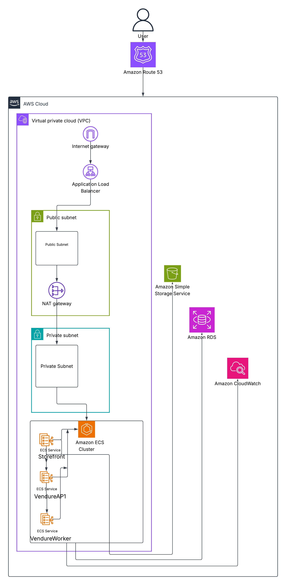

# Vendure Production Platform

> **Building an enterprise-grade software delivery platform that continuously validates and safely promotes upstream Vendure releases into production using AWS, Jenkins, Docker, and Terraform.**

---

##  Purpose

The purpose of this project is to design, build, and operate a production-grade software delivery platform around **Vendure**, a modern headless commerce framework.

Rather than simply deploying an e-commerce application, this project demonstrates how modern Cloud, DevOps, and Platform Engineering teams build secure, automated, scalable, and maintainable production environments.

---

##  Problem Statement

Open-source applications are frequently updated with new features, bug fixes, and security patches. However, directly deploying these updates into production can introduce compatibility issues, regressions, or service outages.

Many demonstration projects focus only on application deployment and do not address the complete software delivery lifecycle, including:

- Automated infrastructure provisioning
- Continuous Integration and Continuous Delivery (CI/CD)
- Security validation
- Release management
- Environment promotion
- Monitoring and observability
- Automated rollback strategies

These capabilities are essential for operating production systems in real-world organizations.

---

##  Solution

This project builds an **enterprise-style software delivery platform** for Vendure.

The platform will continuously monitor upstream Vendure releases, automatically validate new versions through a CI/CD pipeline, deploy them to a staging environment, execute automated quality and security checks, and promote validated releases to production after approval.

The entire infrastructure and deployment process will be managed using Infrastructure as Code (IaC) and cloud-native engineering practices.

---

# Project Goals

The primary goals of this project are to:

- Build a production-grade AWS platform for hosting and managing Vendure applications.
- Design reusable and modular Terraform modules following Infrastructure as Code (IaC) best practices.
- Gain practical, hands-on experience with core AWS services through real-world implementation.
- Implement secure, scalable, and highly available cloud infrastructure based on industry standards.
- Automate infrastructure provisioning, application deployment, and operational workflows.
- Build and maintain custom Docker images for Vendure instead of relying solely on pre-built images.
- Establish a complete software delivery pipeline capable of validating, testing, and promoting new Vendure releases.
- Implement comprehensive monitoring, logging, and observability using industry-standard tools.
- Document the architecture, implementation, and engineering decisions to create a valuable learning resource for future reference.
- Develop a maintainable platform that can be extended with additional AWS services and production capabilities over time.
  

## Technology Stack

### Application
- Vendure
- Node.js
- PostgreSQL
- Redis

### Version Control
- Git
- GitHub

### Containerization
- Docker
- Docker Compose

### CI/CD
- Jenkins

### Infrastructure as Code
- Terraform

### Cloud Platform
- Amazon Web Services (AWS)

### AWS Services
- Amazon ECS (Fargate)
- Amazon ECR
- Amazon RDS (PostgreSQL)
- Amazon S3
- Application Load Balancer (ALB)
- Route 53
- IAM
- Secrets Manager
- CloudWatch

### Monitoring & Observability
- Prometheus
- Grafana
- CloudWatch

### Security
- Trivy
- AWS WAF *(planned)*

---

## Workflow

```text
Vendure Release
        │
        ▼
Release Detection
        │
        ▼
Dependency Update
        │
        ▼
Jenkins Pipeline
        │
        ├── Build
        ├── Unit Tests
        ├── Integration Tests
        ├── Security Scan
        ├── Docker Image Build
        └── Push to Amazon ECR
                │
                ▼
Deploy to Staging
                │
        Automated Validation
                │
        Manual Approval
                │
                ▼
Deploy to Production
                │
                ▼
Monitoring & Health Checks
```

## Production AWS Architecture

The Vendure Production Platform is deployed on AWS using a cost-optimized production architecture. User requests are routed through Amazon Route 53 to an Application Load Balancer. The application runs on Amazon ECS as three independent services: Storefront, Vendure API, and Vendure Worker. Product assets are stored in Amazon S3, application data is stored in Amazon RDS PostgreSQL, and logs are collected using Amazon CloudWatch. The infrastructure is provisioned using Terraform.



---


